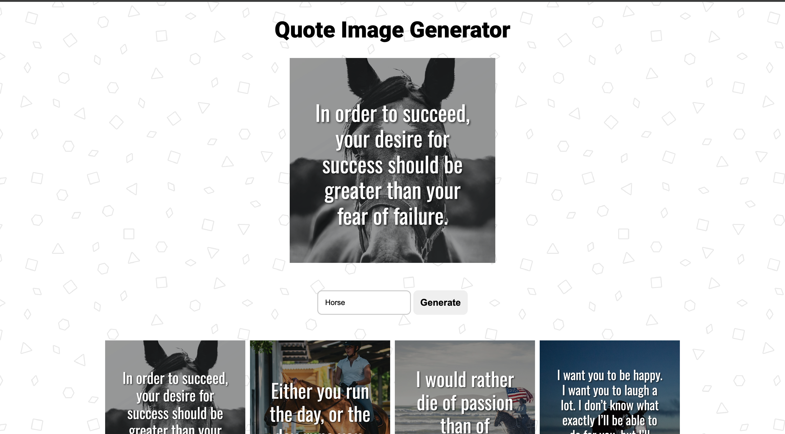
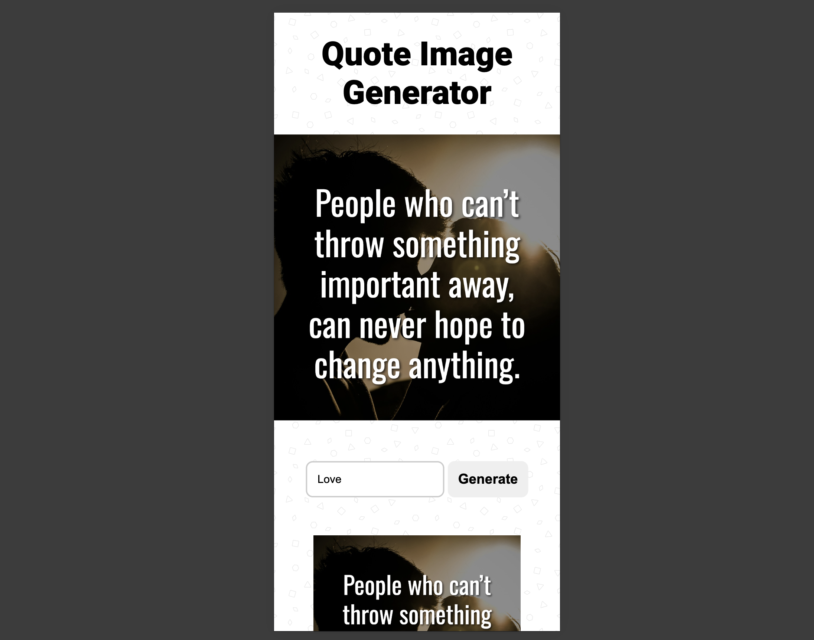

# Social Media Quote Generator

Welcome to the **Social Media Quote Generator**! This application allows users to generate visually appealing quote images by combining images and quotes based on a specified keyword. The generated images are perfect for sharing on social media platforms.
[Live demo](https://l4r4tw.github.io/Social-media-quote-generator/)

---

## **Features**

- 📸 **Image Search**: Pulls relevant images based on a keyword.
- 🖋️ **Quote Search**: Fetches quotes matching the keyword.
- 🎨 **Image Combination**: Merges the selected image and quote into a square format.
- 💾 **Download Option**: Allows downloading the generated image.
- 🚀 **Social Media Ready**: The generated image is optimized for social media platforms like Instagram, Facebook, and Twitter.

---

## **How It Works**

1. **Enter a Keyword**: Type a keyword related to the type of quote/image you want.
2. **Generate Image**: The app searches for matching images and quotes.
3. **Image and Quote Combination**: The selected image and quote are merged into a square canvas using JavaScript.
4. **Download or Share**: Download the generated image or upload it to your favorite social media platform.

---

## **Installation**

1. Clone the repository:
   ```bash
   git clone https://github.com/yourusername/social-media-quote-generator.git
   ```
2. Navigate to the project directory:
   ```bash
   cd social-media-quote-generator
   ```
3. Open `index.html` in your browser to run the app.

---

## **Technologies Used**

- **HTML5**: For the app's structure.
- **CSS3**: For styling and responsive design.
- **JavaScript**: For image and quote generation logic.
- **Canvas API**: For combining quotes and images.

---

## **Usage**

1. Open the application.
2. Enter a keyword (e.g., "motivation," "life," "happiness").
3. Click **Generate**.
4. Preview the generated quote image.
5. Click **Download** to save the image or upload it to social media.

---

## **Screenshots**

### Desktop view



### About Page



---

## **Contributing**

Contributions are welcome! If you'd like to contribute:

1. Fork the repository.
2. Create a new branch:
   ```bash
   git checkout -b feature/your-feature-name
   ```
3. Commit your changes:
   ```bash
   git commit -m "Added new feature"
   ```
4. Push to the branch:
   ```bash
   git push origin feature/your-feature-name
   ```
5. Open a Pull Request.

---

## **License**

This project is licensed under the MIT License. See the [LICENSE](LICENSE) file for details.

---

## **Contact**

- **Author**: Bruno Banoczi
- **GitHub**: [@l4r4TW](https://github.com/L4r4TW)
- **Email**: [your.email@example.com](mailto:your.email@example.com)

Happy Creating! 🚀
